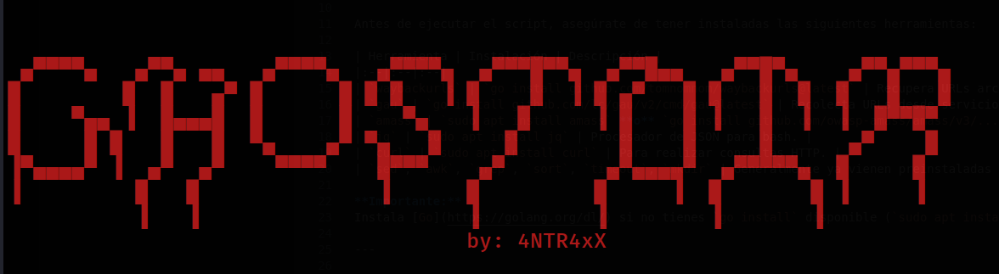
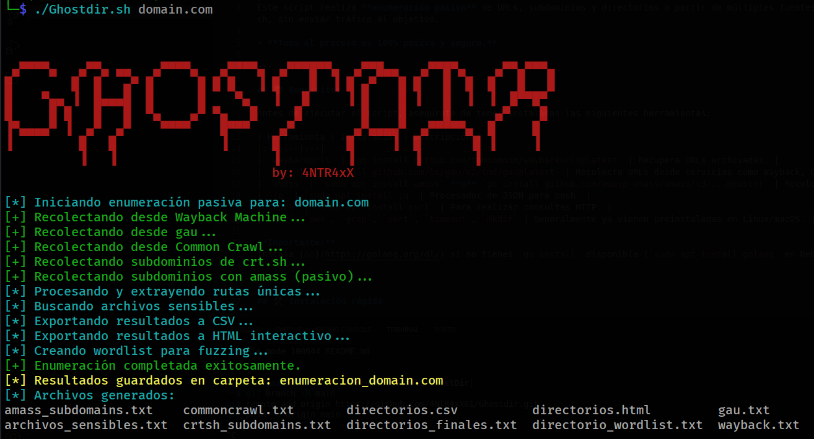

# 🕵️‍♂️ GHOSTDIR -  Enumerador Pasivo de Directorios y Subdominios



Este script realiza **enumeración pasiva** de URLs, subdominios y directorios a partir de múltiples fuentes públicas como Wayback Machine, Common Crawl, y crt.sh, sin enviar tráfico al objetivo.

⚡ **Todo el proceso es 100% pasivo y seguro.**

---

## 📦 Requisitos

Antes de ejecutar el script, asegúrate de tener instaladas las siguientes herramientas:

| Herramienta | Instalación | Descripción |
|:--|:--|:--|
| `waybackurls` | `go install github.com/tomnomnom/waybackurls@latest` | Recupera URLs archivadas. |
| `gau` | `go install github.com/lc/gau/v2/cmd/gau@latest` | Recolecta URLs desde servicios como Wayback, Common Crawl, etc. |
| `amass` | `sudo apt install amass` **o** `go install github.com/owasp-amass/amass/v3/...@master` | Recolector de subdominios. |
| `jq` | `sudo apt install jq` | Procesador de JSON para bash. |
| `curl` | `sudo apt install curl` | Para realizar consultas HTTP. |
| `sed`, `awk`, `grep`, `sort`, `timeout`, `mkdir` | Generalmente ya vienen preinstaladas en Linux/macOS. |

**Importante:**  
Instala [Go](https://golang.org/dl/) si no tienes `go install` disponible (`sudo apt install golang` en Debian/Ubuntu).

---

## 🛠 Instalación rápida

```bash
# Instalar dependencias principales (Debian/Ubuntu)
sudo apt update
sudo apt install curl jq amass sed grep awk coreutils timeout

# Instalar herramientas Go
go install github.com/tomnomnom/waybackurls@latest
go install github.com/lc/gau/v2/cmd/gau@latest
```

**Después de instalar**, asegúrate de que `$GOPATH/bin` esté en tu `$PATH`, por ejemplo:

```bash
export PATH=$PATH:$(go env GOPATH)/bin
```

---

## 🚀 Uso

```bash
git clone https://github.com/4NTR4xX01/Ghostdir.git
cd Ghostdir
chmod +x Ghostdir.sh
./Ghostdir.sh ejemplo.com
```

**Parámetro obligatorio:**  
- `ejemplo.com` → El dominio objetivo (sin `https://`, solo el nombre).

---

## 📂 ¿Qué genera el script?

Se crea una carpeta `enumeracion_<dominio>` con estos archivos:

- `wayback.txt` → URLs desde Wayback Machine.
- `gau.txt` → URLs desde múltiples fuentes.
- `commoncrawl.txt` → URLs desde Common Crawl.
- `crtsh_subdomains.txt` → Subdominios de crt.sh.
- `amass_subdomains.txt` → Subdominios desde Amass (modo pasivo).
- `directorios_finales.txt` → Directorios únicos extraídos de las URLs.
- `archivos_sensibles.txt` → Posibles archivos sensibles (`.zip`, `.sql`, `.env`, etc.).
- `directorio_wordlist.txt` → Wordlist para fuzzing de directorios.
- `directorios.csv` → Listado en formato CSV.
- `directorios.html` → Archivo HTML navegable con enlaces.

---

## 🧠 ¿Qué hace exactamente el script?

1. Recopila URLs históricas de varias fuentes públicas.
2. Extrae los **directorios** únicos.
3. Detecta rutas que parecen apuntar a **archivos sensibles**.
4. Crea exportaciones en **CSV** y **HTML**.
5. Genera una **wordlist** para posibles fuzzings.

✅ **Todo sin enviar ni un solo paquete al dominio objetivo.**

---

## ⚡ Ejemplo de ejecución

```bash
./Ghostdir.sh testphp.vulnweb.com
```

Salida:



---

## 🛡️ Aviso Legal

Este script está diseñado **únicamente para fines educativos y de evaluación ética**.  
El autor no se hace responsable del mal uso.

**Usa este script únicamente en dominios que te pertenezcan o tengas permiso de evaluar.**
